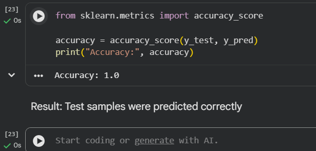

# 📊 Machine Learning Project

## 🧠 Objective
Predict whether a customer will make a repeat purchase within 30 days.

## 📁 Files
- Assignment notebook (in assignments folder)
- Dataset created using pandas
- Output screenshot

## 📸 Model Output

## 🚀 Key Insight
The model achieved high accuracy but dataset is small, so results may not generalize well.
